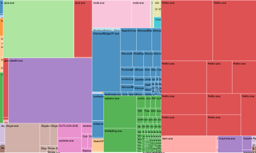

# memgraph
Visual representation of memory usage of programs on Windows

Usage
-----

1. Download/clone this repository.
2. Run `npm ci`
3. Run `npm start`
4. Point your browser to http://localhost:3000/index.htm
